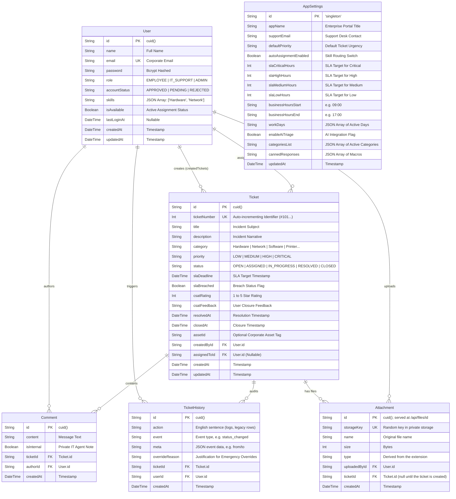

# Smart IT Helpdesk 🚀
### Enterprise IT Service Management & AI-Powered Triage Platform

An enterprise-grade IT Support Ticket Management System built with **Next.js 16 (App Router)**, **TypeScript**, **Prisma ORM + PostgreSQL**, **Tailwind CSS**, and **Google Gemini** (`gemini-2.5-flash` by default) for ticket triage suggestions, ticket summaries for IT staff, and on-demand translation.

---

## 📑 Table of Contents

- [Executive Overview](#-executive-overview)
- [System Architecture & Tech Stack](#-system-architecture--tech-stack)
- [Entity-Relationship (ER) Diagram](#-entity-relationship-er-diagram)
- [Pre-Seeded Test Accounts](#-pre-seeded-test-accounts)
- [Core Capabilities](#-core-capabilities)
  - [Role-Based Access Control (RBAC)](#1-role-based-access-control-rbac)
  - [Deterministic Ticket State Machine](#2-deterministic-ticket-state-machine)
  - [Google Gemini AI Integration](#3-google-gemini-ai-integration)
  - [Bilingual Localization & RTL/LTR Engine](#4-bilingual-localization--rtlltr-engine)
  - [Agent Operational Workflows & Drawers](#5-agent-operational-workflows--drawers)
  - [Multi-Theme & Modern Aesthetic System](#6-multi-theme--modern-aesthetic-system)
  - [Security](#7-security)
- [Environment Variables](#-environment-variables)
- [Installation & Quick Start](#-installation--quick-start)
- [Deployment (Vercel + Neon)](#-deployment-vercel--neon)
- [Automated Testing Suite](#-automated-testing-suite)
- [Project Directory Structure](#-project-directory-structure)
- [Assessment Requirements Compliance](#-assessment-requirements-compliance)

---

## 🌟 Executive Overview

Smart IT Helpdesk bridges the gap between end-user frustration and IT service resolution. Traditional ticketing systems suffer from vague problem descriptions, misrouted tickets, and manual triage delays. 

This platform solves these challenges through:
1. **AI-Assisted Triage & Self-Help:** Google Gemini suggests a category, a priority and a few safe self-help steps while the employee writes the ticket. The employee decides whether to use the suggestion.
2. **Deterministic Lifecycle Enforcement:** Tickets adhere strictly to a verified one-way state transition machine (`OPEN` → `ASSIGNED` → `IN_PROGRESS` → `RESOLVED` → `CLOSED`) with immutable historical audit logs.
3. **Bilingual Enterprise Usability:** Complete native Arabic (RTL) and English (LTR) localization coupled with on-demand Zendesk/Jira-style AI translation for global IT operations.
4. **Agent Productivity Suite:** Fast sliding drawer interfaces, skill-based automated dispatch, SLA breach indicators, and rich visual KPI analytics.

---

## 🛠 System Architecture & Tech Stack

| Layer | Technology | Details / Rationale |
|---|---|---|
| **Framework** | Next.js 16.3+ (App Router) | React Server Components (RSC), Turbopack, and Server Actions |
| **Language** | TypeScript 5 | Strict typing throughout models, APIs, and UI components |
| **Database & ORM** | Prisma ORM 7 (node-postgres adapter) + PostgreSQL (Neon) | Versioned migrations (`prisma/migrations`), check constraints on roles, statuses and ratings; CLI settings in `prisma.config.ts` |
| **Authentication** | `jose` (JWT) + `bcryptjs` | Stateless encrypted HTTP-only session cookies with 12-round salt hashing |
| **AI Engine** | Google Gemini via `@google/genai` (`gemini-2.5-flash`, falls back to `gemini-2.5-flash-lite`) | Schema-validated JSON output for triage and summaries; translation |
| **Styling & Design** | Tailwind CSS + CSS Design Tokens | Clean typography, dark/light adaptive surfaces, and zero-border minimalism |
| **Motion & Charts** | Framer Motion & Recharts | Micro-animations, interactive layout transitions, and queue distribution graphs |
| **Internationalization** | Custom Context Engine + Cookies | Instant zero-reload locale toggling, bidirectional layout (`rtl`/`ltr`) |
| **File Storage** | Vercel Blob (private) or local disk | Attachments are never public; `/api/files/[id]` checks who may see them |
| **Testing & CI** | Vitest + GitHub Actions | Integration tests against a real PostgreSQL test database; lint, types, tests and build on every push |

---

## 📊 Entity-Relationship (ER) Diagram

The system uses a relational database schema designed for high auditability and operational integrity.



---

## 👥 Pre-Seeded Test Accounts

The platform includes 4 pre-configured corporate accounts representing all administrative, operational, and end-user personas. When `DEMO_MODE=true`, the `/login` page also offers them as **1-click demo logins** (off by default, because it puts the passwords in the page).

| Persona | Name | Email | Password | Role | Permissions & Domain Focus |
|---|---|---|---|---|---|
| **System Admin** | System Admin | `admin@company.com` | `admin123` | `ADMIN` | Complete platform governance: user account approvals, global SLA policies, canned macros, and enterprise-wide ticket oversight. |
| **IT Support (Infra)** | Bob Williams | `bob@company.com` | `support123` | `IT_SUPPORT` | Operational triage specialist. Specialized skills in **Network**, **Printer**, **Email & Communication**, and **Access & Permissions**. |
| **IT Support (Systems)** | Mike Davis | `mike@company.com` | `support123` | `IT_SUPPORT` | Systems and workstations specialist. Specialized skills in **Hardware** and **Software** diagnostics. |
| **Corporate Employee** | Alice Johnson | `alice@company.com` | `employee123` | `EMPLOYEE` | Standard enterprise end-user. Restricted to creating tickets, viewing own history, submitting CSAT surveys, and utilizing AI self-help triage. |

---

## ⚡ Core Capabilities

### 1. Role-Based Access Control (RBAC)
- **Data Isolation:** Employees can *only* query and view tickets created by their account. IT Support and Admins have visibility into the comprehensive organizational queue.
- **Server-Side Verification:** Every page, Server Action and API route checks the signed session cookie **and** the user's current record in the database, so the role used is always the current one (see [Security](#7-security)).
- **Zero Client Trust:** UI controls for assignment, internal notes, and status transitions are completely omitted for unauthorized roles.

### 2. Deterministic Ticket State Machine
Tickets advance strictly through a verified linear progression:

$$\mathbf{OPEN} \longrightarrow \mathbf{ASSIGNED} \longrightarrow \mathbf{IN\_PROGRESS} \longrightarrow \mathbf{RESOLVED} \longrightarrow \mathbf{CLOSED}$$

- **Forward-Only Guard:** IT staff cannot move a ticket backwards (e.g., `RESOLVED` → `OPEN`) or skip states (e.g., `OPEN` → `RESOLVED`); the server rejects it.
- **Requester Reopen:** The one deliberate exception: the employee who opened a ticket can reopen it after it is resolved or closed, with a written reason. The ticket goes back to `IN_PROGRESS` (or `OPEN` if unassigned) and the reopen is logged.
- **SLA Tracking:** Each ticket gets a resolution deadline in business hours (per priority, from Settings). Resolution and close times are recorded, and a ticket resolved after its deadline is flagged as an SLA breach.
- **Audit History:** Every state change, assignment and comment is recorded in `TicketHistory` as a typed event (`lib/history.ts`) with the actor and time, so the timeline is shown in the viewer's language.
- **CSAT Feedback Loop:** When an employee closes a resolved ticket, an interactive 5-star Customer Satisfaction (CSAT) rating and feedback form is triggered.
- **Confetti Celebration:** Resolving a ticket triggers an interactive visual celebration via `canvas-confetti`.

### 3. Google Gemini AI Integration
- **Triage suggestions (`/tickets/new`):** Gemini returns a category (one of the admin's categories), a priority and 2–3 self-help steps, in the user's language. The answer is constrained by a JSON schema and validated on the server. The employee clicks **Use this suggestion** or **Dismiss**; nothing is applied automatically.
- **Ticket summaries for IT staff (`/tickets/[id]`):** On request, Gemini summarises the description and the whole discussion and proposes a next step, which can be inserted into the reply.
- **On-demand translation:** Tickets and comments can be translated into the viewer's language without changing the original text.
- **Honest fallbacks:** If Gemini is rate-limited or overloaded, the request is retried on a second model with its own quota. If AI is still unavailable, triage falls back to keyword rules that are clearly labelled as such (this can be turned off in Settings). Translation and summaries show an error instead of inventing text.
- **Safety:** Ticket text is passed to the model as data, with an instruction to ignore instructions inside it, and the server only accepts valid categories and priorities.

### 4. Bilingual Localization & RTL/LTR Engine
- **True Bilingual Architecture:** Complete, professional Arabic (`ar`) and English (`en`) dictionary translation without path alterations (`/ar/tickets` vs `/en/tickets`).
- **Dynamic Directionality:** Automatic HTML document `dir="rtl"` / `dir="ltr"` adjustment paired with localized typography (`Cairo` for Arabic, `Inter` for English).
- **Localized Attributes:** Status badges (`مفتوحة` / `Open`), categories (`طابعات` / `Printer`), priorities, and relative timestamps (`منذ 5 دقائق` / `5 minutes ago`) adapt dynamically to the active session language.

### 5. Agent Operational Workflows & Drawers
- **Slide-Over Ticket Drawer (`TicketDrawer.tsx`):** Allows IT agents to review diagnostics, assign tickets, and post comments directly from the main list without losing page context.
- **Dynamic SLA Breach Badges:** Color-coded countdown chips warning agents of approaching deadlines (4-hour window) and overdue states.
- **Skill-Based Automatic Routing:** When enabled in Settings, new tickets go to the available agent whose skills include the ticket category and who has the fewest open tickets.
- **Phone Layout:** On small screens the sidebar becomes a slide-in menu.

### 6. Multi-Theme & Modern Aesthetic System
- **Minimalist Frameless Design:** Clean borderless authentication screens with high-contrast, professional typography.
- **Theme Modes:** Supports Light Mode, Dark Mode, and System Default.
- **Accent Palettes:** Configurable branding accents including Corporate Blue, Slate, Indigo/Violet, and Emerald Green.

### 7. Security
- **Sessions checked on every request** (`lib/session-check.ts`): suspending, rejecting or deleting a user, changing their role, or turning on maintenance mode takes effect on their next click. The cookie is removed and the login page says why. Changing a password signs out the user's other devices (`User.sessionVersion`).
- **Rate limits** (`lib/rate-limit.ts`, stored in the database so they hold across restarts and servers):
  - Sign-in: 5 failures lock the account for 15 minutes; 20 failures lock the client address.
  - Account requests: 5 per hour per address.
  - AI: 30 Gemini requests per user per 10 minutes. Over the limit, triage falls back to the keyword rules.
- **Nothing from the browser is trusted:** categories must be the admin's, priorities and lengths are checked, a ticket can only use the requester's own uploads, tickets can only be assigned to active IT staff, and a ticket can be rated once.
- **Concurrency:** ticket numbers can't collide (transaction + retry on the unique index), and a status change or take-over only applies if nobody changed the ticket first.
- **No account enumeration:** the login and account request forms answer the same way whether or not an email is registered.
- **Admins can't lock themselves out:** they cannot suspend or demote their own account.
- **Headers:** no framing (clickjacking), `nosniff`, referrer and permissions policies, HSTS.
- **Errors** are returned as codes (`lib/errors.ts`) and shown in the user's language.

---

## 🔐 Environment Variables

Copy `.env.example` to `.env`; every variable is explained there.

| Variable | Required | Purpose |
|---|---|---|
| `DATABASE_URL` | yes | PostgreSQL connection used by the app (on Neon: the **pooled** string) |
| `DIRECT_URL` | yes | Direct connection used by migrations (on Neon: the **unpooled** string; locally the same as `DATABASE_URL`) |
| `SESSION_SECRET` | yes | Signs the session cookie; at least 32 random characters |
| `GEMINI_API_KEY` | no | Google Gemini for triage suggestions, summaries and translation |
| `GEMINI_MODEL` / `GEMINI_FALLBACK_MODEL` | no | Override the models (defaults `gemini-2.5-flash` / `gemini-2.5-flash-lite`) |
| `BLOB_READ_WRITE_TOKEN` | on Vercel | Private Vercel Blob store for attachments (set by Vercel when the store is connected) |
| `STORAGE_DIR` | no | Local folder for attachments when there is no Blob token (default `.data/uploads`) |
| `DEMO_MODE` | no | `true` shows 1-click logins for the seeded accounts. Never with real users |
| `TEST_DATABASE_URL` | for tests | Separate database for `npm test`, wiped on every run; its name must end in `_test` |

> **Without a Gemini key** the app still works: triage suggestions come from labelled keyword rules (if enabled in Settings), and summaries/translation report that AI is not configured. Google's free tier allows only a few requests per minute per model, which is why a fallback model is used.

---

## 🚀 Installation & Quick Start

### 1. Prerequisites
- **Node.js** 22 or newer
- A **PostgreSQL** database. A free [Neon](https://neon.tech) project works: use its default database for the app, and create a second one named `helpdesk_test` for the tests.

### 2. Setup Instructions

```bash
# 1. Install dependencies (also generates the Prisma client)
npm install

# 2. Configure: database URLs, SESSION_SECRET, and GEMINI_API_KEY if you have one
cp .env.example .env

# 3. Create the tables
npm run db:deploy

# 4. Demo data: users, categories, tickets #101-#108 (deletes existing users and tickets)
npm run db:seed

# 5. Start the app
npm run dev
```

Open [http://localhost:3000](http://localhost:3000).

**Changing the schema:** edit `prisma/schema.prisma`, then `npm run db:migrate -- --name what_changed` creates and applies a migration. Commit it; deployments apply it with `prisma migrate deploy`.

**Inviting users:** admins can invite a user from *User Management*. Until email is set up, the admin receives a one-time password to share; the user must choose their own password at first sign-in.

---

## ☁️ Deployment (Vercel + Neon)

1. **Database:** create a project on [Neon](https://neon.tech). Copy the *pooled* connection string (host contains `-pooler`) and the *direct* one, and change `sslmode=require` to `sslmode=verify-full` in both (checks the server's certificate).
2. **Vercel project:** import the GitHub repository on [Vercel](https://vercel.com). Vercel runs `npm run vercel-build`, which applies pending migrations and builds. `vercel.json` runs the app in Frankfurt (`fra1`), next to the database; if your Neon project is in another region, change it to match, or every query crosses an ocean.
3. **Environment variables** (Project → Settings → Environment Variables): `DATABASE_URL` (pooled), `DIRECT_URL` (direct), `SESSION_SECRET`, `GEMINI_API_KEY`, and `DEMO_MODE` if this is a demo.
4. **Attachments:** Storage → create a **Blob** store with **private** access and connect it to the project (this sets `BLOB_READ_WRITE_TOKEN`).
5. **Deploy**, then load the demo data once from your machine with the Neon *direct* URL: `DATABASE_URL=... npm run db:seed`.
6. **Check:** `https://<your-app>/api/health` should answer `{"status":"ok"}`.

---

## 🧪 Automated Testing Suite

The repository contains an automated test suite implemented with **Vitest**. Integration tests run against their own PostgreSQL database (`TEST_DATABASE_URL`, rebuilt from the migrations before every run, so the app's data is never touched; in CI a PostgreSQL service container) with only the Next.js request context and the Gemini SDK stubbed; unit tests cover the AI wrapper, triage rules, skills and audit-trail events.

```bash
# Execute test suite once
npm test

# Run tests in watch mode
npm run test:watch
```

### Test Coverage Breakdown (149/149 Passing)

```
✓ tests/ai-triage.test.ts (10 tests)
  ✓ parseTriageResponse (4)
    ✓ accepts a valid answer and cleans it up
    ✓ rejects a category the admin has not configured
    ✓ rejects an unknown priority
    ✓ rejects an answer without self-help steps
  ✓ ruleBasedTriage (6)
    ✓ is always labelled as rules, never as AI
    ✓ prefers the more specific rule ("network printer" is a printer issue)
    ✓ matches English keywords on word boundaries only
    ✓ understands Arabic tickets and answers in Arabic
    ✓ raises priority to CRITICAL for outages affecting everyone
    ✓ only suggests categories that exist in the admin settings
✓ tests/gemini.test.ts (6 tests)
  ✓ Gemini client (6)
    ✓ treats the README placeholder key as not configured
    ✓ falls back to the second model when the first is rate-limited
    ✓ does not retry errors that another model would not fix
    ✓ fails when every model is rate-limited, so callers can fall back honestly
    ✓ disables thinking on 2.5 models for speed
    ✓ rejects a triage answer with a category the admin does not have
✓ tests/helpdesk.test.ts (115 tests)
  ✓ Test 1: User Login (7)
    ✓ valid credentials create a session for the user and redirect to their tickets
    ✓ IT_SUPPORT is redirected to their assigned queue
    ✓ wrong password is rejected without creating a session
    ✓ unknown email gets the same generic error (no account enumeration)
    ✓ "remember me" asks for a long-lived session, and email case does not matter
    ✓ maintenance mode keeps everyone but admins out
    ✓ accounts pending approval cannot log in
  ✓ Test 2: Ticket Creation (5)
    ✓ creates an OPEN ticket with the next number, an SLA deadline and an audit entry
    ✓ rejects missing or too-short fields without creating a ticket
    ✓ auto-assigns to a matching agent only when the admin setting is on
    ✓ auto-assignment understands agents saved with the old skill names
    ✓ redirects signed-out users to the login page
  ✓ Test 3: Role Authorization (6)
    ✓ EMPLOYEE cannot change ticket status
    ✓ EMPLOYEE cannot assign or take over tickets
    ✓ EMPLOYEE cannot promote themselves to ADMIN
    ✓ IT_SUPPORT cannot use admin-only actions
    ✓ admins can only give agents skills that are real categories
    ✓ IT_SUPPORT cannot change the status of another agent's ticket
  ✓ Test 4: Status Lifecycle State Machine (8)
    ✓ rejects skipping from OPEN to IN_PROGRESS
    ✓ rejects skipping from OPEN to RESOLVED
    ✓ rejects skipping from OPEN to CLOSED
    ✓ OPEN → ASSIGNED claims the unassigned ticket for the agent
    ✓ ASSIGNED → IN_PROGRESS → RESOLVED
    ✓ rejects going backwards from RESOLVED
    ✓ RESOLVED → CLOSED, after which every transition is rejected
    ✓ records each successful transition in the audit trail, and nothing for rejected ones
  ✓ Test 5: Data Isolation (8)
    ✓ ticket list page shows an EMPLOYEE only their own tickets
    ✓ ticket list page shows IT_SUPPORT every ticket in the "all" queue
    ✓ ticket detail page returns 404 for another employee's ticket
    ✓ getTicketDetails returns null when an EMPLOYEE requests another user ticket
    ✓ getTicketDetails returns the ticket to its EMPLOYEE owner without internal notes
    ✓ getTicketDetails returns any ticket, with internal notes, to IT_SUPPORT
    ✓ EMPLOYEE cannot comment on another employee's ticket
    ✓ EMPLOYEE comments are always public, even if they ask for an internal note
  ✓ Test 6: API Authentication & Upload Safety (7)
    ✓ upload rejects unauthenticated requests
    ✓ upload rejects HTML and SVG files that browsers would execute
    ✓ upload rejects files larger than 4 MB (the hosting limit per request)
    ✓ upload rejects more than 5 files at once
    ✓ upload stores an allowed file privately, under a random name, with the server-side type
    ✓ AI triage route rejects unauthenticated requests without calling Gemini
    ✓ translateAction rejects unauthenticated callers without calling Gemini
  ✓ Test 7: AI Features (6)
    ✓ triage returns the Gemini answer labelled as AI
    ✓ triage falls back to keyword rules, labelled as rules, when Gemini fails
    ✓ triage returns 503 instead of guessing when the admin disabled the fallback
    ✓ triage is refused when the admin turned AI triage off
    ✓ ticket summaries are only available to IT support and admins
    ✓ translation reports an honest error instead of inventing text
  ✓ Test 8: SLA Tracking (5)
    ✓ records when a ticket was resolved and that it met its SLA
    ✓ flags a ticket resolved after its deadline as an SLA breach
    ✓ records the close time, and reopening clears both times but keeps the breach
    ✓ the admin "SLA breaches" view lists overdue and late-resolved tickets only
    ✓ the "pending requests" link opens the users page filtered to pending accounts
  ✓ Test 9: Admin Settings (11)
    ✓ only admins can change settings
    ✓ rejects an unknown priority
    ✓ rejects negative SLA hours
    ✓ rejects fractional SLA hours
    ✓ rejects a malformed time
    ✓ rejects hours that end before they start
    ✓ rejects an invalid work day
    ✓ rejects no categories
    ✓ rejects a bad email
    ✓ rejects a domain without @
    ✓ saves valid settings
  ✓ Test 10: Invites & Passwords (10)
    ✓ only admins can invite users
    ✓ an invite creates an INVITED account and returns a one-time password
    ✓ signing in with the temporary password forces a password change
    ✓ the proxy keeps a user with a temporary password on the password page
    ✓ rejects the change when the current password is wrong
    ✓ rejects the change when the new password is too short
    ✓ rejects the change when the confirmation does not match
    ✓ rejects the change when the new password equals the old one
    ✓ setting a password activates the account and continues into the app
    ✓ any user can change their password later without being redirected
  ✓ Test 11: Sessions (10)
    ✓ an active user keeps their session, with role and name read from the database
    ✓ a role taken away ends admin access on the next request
    ✓ a SUSPENDED account is signed out and told why
    ✓ a REJECTED account is signed out and told why
    ✓ a PENDING account is signed out and told why
    ✓ a deleted account is signed out
    ✓ on the login page an ended session is cleared without a redirect loop
    ✓ changing the password signs out other devices but keeps this one
    ✓ maintenance mode ends the sessions of everyone but admins
    ✓ demo logins are only offered when DEMO_MODE=true
  ✓ Test 12: Sign-in Rate Limiting (4)
    ✓ locks an account for 15 minutes after 5 wrong passwords, even for the right password
    ✓ allows the account again once the 15-minute window has passed
    ✓ a successful sign-in resets the count of failures
    ✓ locks out an address that tries many accounts
  ✓ Test 13: Server-side Validation (12)
    ✓ a ticket needs one of the admin categories and a real priority
    ✓ a ticket can only use the requester's own uploads that are not attached elsewhere
    ✓ attachments are only served to people who may see the ticket
    ✓ tickets created at the same moment still get different numbers
    ✓ tickets can only be given to active IT support staff
    ✓ a closed ticket cannot be taken over or reassigned
    ✓ when two agents claim the same ticket at once, only one wins
    ✓ comments must exist, be non-empty and not too long, on a real ticket
    ✓ a ticket can be rated once, from 1 to 5, after it is resolved
    ✓ an admin cannot suspend or demote themselves
    ✓ the account request form does not reveal whether an email is registered
    ✓ limits account requests from one address
  ✓ Test 14: AI Usage Limit (3)
    ✓ counts each AI request against the user
    ✓ over the limit, triage answers with the keyword rules without calling Gemini
    ✓ over the limit, summaries and translation are refused
  ✓ Test 15: Review Fixes (3)
    ✓ the users page checks for an admin itself, not only in the layout
    ✓ claiming an unassigned ticket is logged as a claim, not "taken over from Unassigned"
    ✓ canned replies are read safely from the settings
  ✓ Test 16: Reopened SLA & Agents Who Leave (4)
    ✓ a reopened ticket gets a fresh SLA deadline but keeps an earlier breach
    ✓ when an agent is suspended, their unfinished tickets go back to the queue
    ✓ when an agent is made an employee, their unfinished tickets go back to the queue
    ✓ approving or keeping an agent does not touch their tickets
  ✓ Test 17: Audit Fixes (6)
    ✓ auth guards are not exported from a 'use server' file (where every export is a public endpoint)
    ✓ an unknown email still pays for a password check, so it takes as long as a wrong password
    ✓ an account request for a registered email still hashes the password
    ✓ a user can have at most 10 uploads waiting, and removing one frees a place
    ✓ a user can upload at most 30 files an hour
    ✓ only the uploader can delete an upload, and never once it belongs to a ticket
✓ tests/history.test.ts (14 tests)
  ✓ ticket audit trail (14)
    ✓ stores the event, its data and an English sentence
    ✓ shows events in the viewer’s language with translated statuses
    ✓ has a translation for every event type in both languages
    ✓ falls back to the stored text for rows without an event
    ✓ recognises the old sentence "Ticket #101 created"
    ✓ recognises the old sentence "System auto-assigned ticket to Bob Williams based on category (Email & Communication)"
    ✓ recognises the old sentence "No available specialist found — ticket queued in unassigned"
    ✓ recognises the old sentence "Status changed: ASSIGNED → IN_PROGRESS"
    ✓ recognises the old sentence "Ticket claimed and status changed from OPEN to ASSIGNED"
    ✓ recognises the old sentence "Reassigned from Bob to Mike by Admin User"
    ✓ recognises the old sentence "Ticket reopened by requester. Reason: still broken"
    ✓ recognises the old sentence "CSAT Rating submitted: 5 Stars"
    ✓ round-trips: every sentence the app writes can be recognised again
    ✓ the queued ticket in the seed data keeps its category
✓ tests/skills.test.ts (4 tests)
  ✓ agent skills (4)
    ✓ maps the old short names to the current category names and removes duplicates
    ✓ survives empty or corrupt data
    ✓ only keeps skills that are current categories
    ✓ matches categories exactly, not as substrings of the JSON text
```

## ⚠️ Known Limitations

1. **Advisory AI:** Suggestions and summaries assist people; they never change a ticket on their own.
2. **No email yet:** Invites show a one-time password to the admin, and password resets are done by IT.
3. **Attachments are limited to 4 MB each:** files go through the app server, and Vercel limits request bodies to 4.5 MB.
4. **Behind a proxy:** per-address rate limits use `X-Forwarded-For`, so a deployment must sit behind a reverse proxy that sets it (Vercel does).

---

## 📂 Project Directory Structure

```
smart-helpdesk/
├── app/
│   ├── actions/               # Server Actions
│   │   ├── auth.ts            # Login, register, logout
│   │   ├── account.ts         # Change password (incl. first sign-in)
│   │   ├── admin.ts           # Users: status, role & skills, invites
│   │   ├── settings.ts        # Validated admin settings
│   │   ├── tickets.ts         # Ticket CRUD & strict state machine
│   │   └── translate.ts       # On-demand AI translation
│   ├── account/password/      # Change-password page
│   ├── admin/                 # Administrator portal (settings, tickets, users)
│   ├── api/                   # REST API routes
│   │   ├── ai/                # Gemini triage and ticket summaries
│   │   ├── files/[id]/        # Serves an attachment to those allowed to see it
│   │   ├── health/            # Liveness check (database)
│   │   └── upload/            # File attachments (type & size checked)
│   ├── components/            # Shared UI (drawer, AI summary, translate button, responsive sidebar…)
│   ├── login/                 # Sign-in page and walk-through
│   ├── register/              # Account request
│   └── tickets/               # Ticket list, detail page and new-ticket form
├── lib/
│   ├── ai/triage.ts           # AI answer validation + labelled keyword fallback
│   ├── gemini.ts              # Gemini client: model fallback, triage, summaries, translation
│   ├── history.ts             # Typed audit-trail events and their display
│   ├── session.ts             # JWT session cookie via jose
│   ├── session-check.ts       # Session re-checked against the database
│   ├── rate-limit.ts          # Sign-in, account request and AI limits
│   ├── errors.ts              # Error codes shown in the user's language
│   ├── demo.ts                # 1-click demo logins (DEMO_MODE)
│   ├── storage.ts             # Private file storage (Vercel Blob or local disk)
│   ├── settings.ts / skills.ts / sla.ts / uploads.ts / ticket-rules.ts
│   └── i18n/                  # Arabic/English dictionaries and provider
├── prisma/
│   ├── schema.prisma          # Database models
│   ├── migrations/            # Versioned SQL migrations (PostgreSQL)
│   └── seed.ts                # Demo data
├── proxy.ts                   # Route protection (roles, forced password change)
├── scripts/
│   ├── run-ts.js              # Run TypeScript files with plain Node
│   └── seed.js                # npm run db:seed
├── .github/workflows/ci.yml   # Lint, types, tests (PostgreSQL) and build on every push
├── tests/                     # 149 Vitest tests (5 files)
├── AI-USAGE.md                # AI transparency & ethics documentation
├── vitest.config.ts           # Vitest configuration
└── README.md                  # Comprehensive enterprise documentation
```

---

## 🎯 Assessment Requirements Compliance

| Requirement | Implementation Verification | Status |
|---|---|---|
| **Role-Based Authentication** | JWT with `jose` re-checked against the database, bcrypt hashing, sign-in rate limiting, roles `EMPLOYEE`, `IT_SUPPORT`, `ADMIN` | ✅ Complete |
| **Data Isolation** | Employees restricted to own tickets; IT/Admin view entire queue; verified via 8 automated tests | ✅ Complete |
| **Ticket Lifecycle Machine** | `OPEN → ASSIGNED → IN_PROGRESS → RESOLVED → CLOSED`; invalid/backward transitions rejected | ✅ Complete |
| **Audit Logging** | Every status change, assignment and comment logged in `TicketHistory` as a typed, translatable event | ✅ Complete |
| **AI Copilot & Triage** | Gemini suggests category, priority and self-help (schema-validated, Accept/Dismiss); summaries for IT staff | ✅ Complete |
| **On-Demand AI Translation** | Inline translation of tickets & comments into the viewer's language; clear error when AI is unavailable | ✅ Complete |
| **Bilingual Localization** | Native Arabic (RTL) & English (LTR) language support with persistent cookies/localStorage | ✅ Complete |
| **Analytics Dashboard** | KPI cards, SLA countdown badges and status chart; the list refreshes every 30s | ✅ Complete |
| **Drawer Triage Workflow** | Sliding `TicketDrawer` enabling rapid triage and updates without leaving the dashboard | ✅ Complete |
| **Automated Testing** | 149 unit & integration tests against the real code, all passing | ✅ Complete |
| **Production Build** | Clean Next.js 16 production build (`npm run build`) with zero TypeScript errors | ✅ Complete |

---

*Engineered with precision for modern enterprise IT service excellence.*
