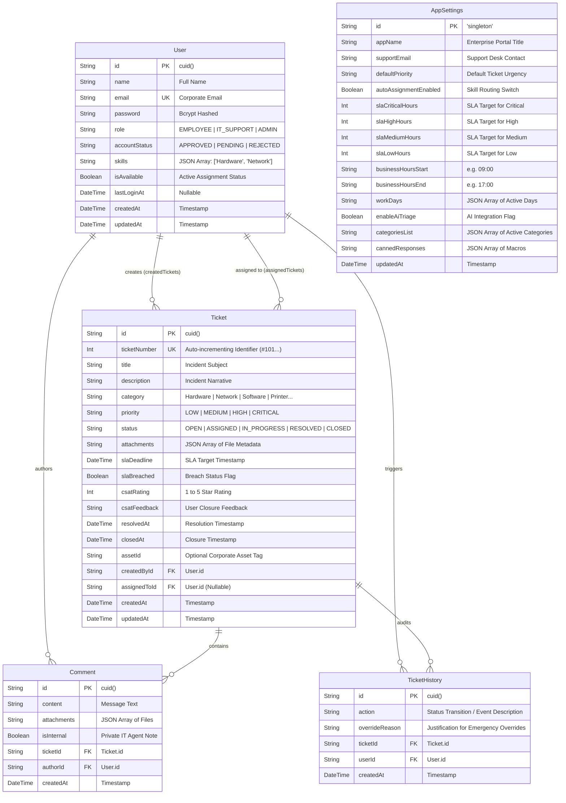

# Smart IT Helpdesk 🚀
### Enterprise IT Service Management & AI-Powered Triage Platform

An enterprise-grade IT Support Ticket Management System built with **Next.js 16 (App Router)**, **TypeScript**, **Prisma ORM + SQLite**, **Tailwind CSS**, and **Google Gemini 2.0 Flash AI** for autonomous triage, automated diagnostics, and on-demand cross-language translation.

---

## 📑 Table of Contents

- [Executive Overview](#-executive-overview)
- [System Architecture & Tech Stack](#-system-architecture--tech-stack)
- [Entity-Relationship (ER) Diagram](#-entity-relationship-er-diagram)
- [Pre-Seeded Test Accounts](#-pre-seeded-test-accounts)
- [Core Capabilities](#-core-capabilities)
  - [Role-Based Access Control (RBAC)](#1-role-based-access-control-rbac)
  - [Deterministic Ticket State Machine](#2-deterministic-ticket-state-machine)
  - [Google Gemini 2.0 Flash AI Integration](#3-google-gemini-20-flash-ai-integration)
  - [Bilingual Localization & RTL/LTR Engine](#4-bilingual-localization--rtlltr-engine)
  - [Agent Operational Workflows & Drawers](#5-agent-operational-workflows--drawers)
  - [Multi-Theme & Modern Aesthetic System](#6-multi-theme--modern-aesthetic-system)
- [Environment Variables](#-environment-variables)
- [Installation & Quick Start](#-installation--quick-start)
- [Automated Testing Suite](#-automated-testing-suite)
- [Project Directory Structure](#-project-directory-structure)
- [Assessment Requirements Compliance](#-assessment-requirements-compliance)

---

## 🌟 Executive Overview

Smart IT Helpdesk bridges the gap between end-user frustration and IT service resolution. Traditional ticketing systems suffer from vague problem descriptions, misrouted tickets, and manual triage delays. 

This platform solves these challenges through:
1. **Intelligent Self-Help & Triage:** Powered by Google Gemini 2.0 Flash, issues are analyzed at creation to offer employees instant self-help solutions while proposing accurate categories and priority levels.
2. **Deterministic Lifecycle Enforcement:** Tickets adhere strictly to a verified one-way state transition machine (`OPEN` → `ASSIGNED` → `IN_PROGRESS` → `RESOLVED` → `CLOSED`) with immutable historical audit logs.
3. **Bilingual Enterprise Usability:** Complete native Arabic (RTL) and English (LTR) localization coupled with on-demand Zendesk/Jira-style AI translation for global IT operations.
4. **Agent Productivity Suite:** Fast sliding drawer interfaces, skill-based automated dispatch, SLA breach indicators, and rich visual KPI analytics.

---

## 🛠 System Architecture & Tech Stack

| Layer | Technology | Details / Rationale |
|---|---|---|
| **Framework** | Next.js 16.3+ (App Router) | React Server Components (RSC), Turbopack, and Server Actions |
| **Language** | TypeScript 5 | Strict typing throughout models, APIs, and UI components |
| **Database & ORM** | Prisma ORM + SQLite (`dev.db`) | Zero-config, ACID-compliant local database with relational schema |
| **Authentication** | `jose` (JWT) + `bcryptjs` | Stateless encrypted HTTP-only session cookies with 12-round salt hashing |
| **AI Engine** | Google Gemini 2.0 Flash (`@google/genai`) | Low-latency structured JSON generation, diagnostics, and translation |
| **Styling & Design** | Tailwind CSS + CSS Design Tokens | Clean typography, dark/light adaptive surfaces, and zero-border minimalism |
| **Motion & Charts** | Framer Motion & Recharts | Micro-animations, interactive layout transitions, and queue distribution graphs |
| **Internationalization** | Custom Context Engine + Cookies | Instant zero-reload locale toggling, bidirectional layout (`rtl`/`ltr`) |
| **Testing** | Vitest | 36 automated unit and integration tests covering security, state, and RBAC |

---

## 📊 Entity-Relationship (ER) Diagram

The system uses a relational database schema designed for high auditability and operational integrity.



---

## 👥 Pre-Seeded Test Accounts

The platform includes 4 pre-configured corporate accounts representing all administrative, operational, and end-user personas. These accounts are also accessible via **1-Click Quick Demo Login** on the `/login` page.

| Persona | Name | Email | Password | Role | Permissions & Domain Focus |
|---|---|---|---|---|---|
| **System Admin** | System Admin | `admin@company.com` | `admin123` | `ADMIN` | Complete platform governance: user account approvals, global SLA policies, canned macros, and enterprise-wide ticket oversight. |
| **IT Support (Infra)** | Bob Williams | `bob@company.com` | `support123` | `IT_SUPPORT` | Operational triage specialist. Specialized skills in **Network**, **Printer**, **Email & Communication**, and **Access & Permissions**. |
| **IT Support (Systems)** | Mike Davis | `mike@company.com` | `support123` | `IT_SUPPORT` | Systems and workstations specialist. Specialized skills in **Hardware** and **Software** diagnostics. |
| **Corporate Employee** | Alice Johnson | `alice@company.com` | `employee123` | `EMPLOYEE` | Standard enterprise end-user. Restricted to creating tickets, viewing own history, submitting CSAT surveys, and utilizing AI self-help triage. |

---

## ⚡ Core Capabilities

### 1. Role-Based Access Control (RBAC)
- **Data Isolation:** Employees can *only* query and view tickets created by their account. IT Support and Admins have visibility into the comprehensive organizational queue.
- **Server-Side Verification:** Every Server Action (`app/actions/tickets.ts`, `app/actions/auth.ts`) cryptographically inspects the JWT payload session cookie before database execution.
- **Zero Client Trust:** UI controls for assignment, internal notes, and status transitions are completely omitted for unauthorized roles.

### 2. Deterministic Ticket State Machine
Tickets advance strictly through a verified linear progression:

$$\mathbf{OPEN} \longrightarrow \mathbf{ASSIGNED} \longrightarrow \mathbf{IN\_PROGRESS} \longrightarrow \mathbf{RESOLVED} \longrightarrow \mathbf{CLOSED}$$

- **Forward-Only Guard:** Backward transitions (e.g., `RESOLVED` → `OPEN`) and skipped states (e.g., `OPEN` → `RESOLVED`) are rejected with explicit server errors.
- **Immutable Audit History:** Every state change, assignment alteration, and override is recorded in `TicketHistory` with the actor's ID and timestamp.
- **CSAT Feedback Loop:** When an employee closes a resolved ticket, an interactive 5-star Customer Satisfaction (CSAT) rating and feedback form is triggered.
- **Confetti Celebration:** Resolving a ticket triggers an interactive visual celebration via `canvas-confetti`.

### 3. Google Gemini 2.0 Flash AI Integration
- **Autonomous Triage (`/tickets/new`):**
  - Synthesizes incident title and narrative in real time.
  - Predicts category and priority with high precision.
  - Generates 2–3 immediately actionable self-help troubleshooting steps for the user.
  - **Human-in-the-Loop Transparency:** AI recommendations appear in a dedicated preview panel where the employee explicitly clicks **[✓ Accept AI Suggestion]** or **[Dismiss]**.
- **Agent Diagnostic Advisor (`/tickets/[id]`):**
  - Generates executive summaries of complex comment threads.
  - Formulates technical root-cause hypotheses and provides 1-click **"+ Copy to reply draft"** technical guidance.
- **Zendesk/Jira-Style On-Demand Translation:**
  - Embedded **`[ ✨ ترجمة بواسطة الذكاء الاصطناعي ]`** button on tickets and comment timelines.
  - Enables IT agents and employees to view instant translations in their preferred language underneath the text without modifying the original database record.
  - Built-in heuristic fallbacks ensure zero disruption even during API quota exhaustion.

### 4. Bilingual Localization & RTL/LTR Engine
- **True Bilingual Architecture:** Complete, professional Arabic (`ar`) and English (`en`) dictionary translation without path alterations (`/ar/tickets` vs `/en/tickets`).
- **Dynamic Directionality:** Automatic HTML document `dir="rtl"` / `dir="ltr"` adjustment paired with localized typography (`Cairo` for Arabic, `Inter` for English).
- **Localized Attributes:** Status badges (`مفتوحة` / `Open`), categories (`طابعات` / `Printer`), priorities, and relative timestamps (`منذ 5 دقائق` / `5 minutes ago`) adapt dynamically to the active session language.

### 5. Agent Operational Workflows & Drawers
- **Slide-Over Ticket Drawer (`TicketDrawer.tsx`):** Allows IT agents to review diagnostics, assign tickets, and post comments directly from the main list without losing page context.
- **Dynamic SLA Breach Badges:** Color-coded countdown chips warning agents of approaching deadlines (4-hour window) and overdue states.
- **Skill-Based Automatic Routing:** Automatically maps new tickets to available agents whose profile skills match the predicted category.

### 6. Multi-Theme & Modern Aesthetic System
- **Minimalist Frameless Design:** Clean borderless authentication screens with high-contrast, professional typography.
- **Theme Modes:** Supports Light Mode, Dark Mode, and System Default.
- **Accent Palettes:** Configurable branding accents including Corporate Blue, Slate, Indigo/Violet, and Emerald Green.

---

## 🔐 Environment Variables

Create a `.env` file in the root directory with the following configuration:

```env
# Database Connection (SQLite local file)
DATABASE_URL="file:./dev.db"

# JWT Secret for Session Cookie Encryption (min. 32 characters)
SESSION_SECRET="super-secret-key-change-in-production-min-32-chars"

# Google Gemini API Key (for automated triage, summaries, and translation)
GEMINI_API_KEY="your-gemini-api-key-here"
```

> **Note:** The application includes intelligent fallback heuristics. If `GEMINI_API_KEY` is not provided or quota is exceeded, the platform continues to function smoothly with local deterministic triage and translation algorithms.

---

## 🚀 Installation & Quick Start

### 1. Prerequisites
- **Node.js:** v18.18.0 or newer (v20+ recommended)
- **npm:** v9.0.0 or newer

### 2. Setup Instructions

```bash
# 1. Clone repository
git clone <repository-url>
cd smart-helpdesk

# 2. Install dependencies
npm install

# 3. Synchronize database schema
npx prisma db push

# 4. Populate default database seed (Users, Categories, Seed Tickets #101-#108)
npm run db:seed

# 5. Launch development server with Turbopack
npm run dev
```

Open [http://localhost:3000](http://localhost:3000) in your browser.

---

## 🧪 Automated Testing Suite

The repository contains an automated test suite implemented with **Vitest**, providing comprehensive test coverage across 5 core enterprise domains:

```bash
# Execute test suite once
npm test

# Run tests in watch mode
npm run test:watch
```

### Test Coverage Breakdown (36/36 Passing)

```
✓ tests/helpdesk.test.ts (36 tests)
  ✓ Test 1: User Login (4 tests)
    ✓ should find employee user by email
    ✓ should validate correct password
    ✓ should reject incorrect password
    ✓ should return null for non-existent email
  ✓ Test 2: Ticket Creation (3 tests)
    ✓ should create a ticket with correct defaults
    ✓ should log ticket creation in history
    ✓ should retrieve the created ticket with relations
  ✓ Test 3: Role Authorization (4 tests)
    ✓ EMPLOYEE role should not be IT_SUPPORT
    ✓ IT_SUPPORT role should have elevated privileges
    ✓ should simulate role check blocking employee from status update
    ✓ should allow IT_SUPPORT to update status
  ✓ Test 4: Status Lifecycle State Machine (10 tests)
    ✓ should allow OPEN → ASSIGNED transition
    ✓ should allow ASSIGNED → IN_PROGRESS transition
    ✓ should allow IN_PROGRESS → RESOLVED transition
    ✓ should allow RESOLVED → CLOSED transition
    ✓ should REJECT OPEN → IN_PROGRESS (skipping ASSIGNED)
    ✓ should REJECT OPEN → RESOLVED (skipping steps)
    ✓ should REJECT CLOSED → OPEN (backwards transition)
    ✓ should REJECT RESOLVED → OPEN (backwards transition)
    ✓ should apply ASSIGNED status in database when IT_SUPPORT assigns ticket
    ✓ should progress through full lifecycle: ASSIGNED → IN_PROGRESS → RESOLVED → CLOSED
  ✓ Test 5: Data Isolation (7 tests)
    ✓ EMPLOYEE query should only return their own tickets
    ✓ EMPLOYEE accessing another user ticket by ID should be blocked
    ✓ IT_SUPPORT should see all tickets regardless of creator
    ✓ EMPLOYEE should not be able to comment on another employee ticket
    ✓ getTicketDetails returns null when an EMPLOYEE requests another user ticket
    ✓ getTicketDetails returns the ticket to its EMPLOYEE owner
    ✓ getTicketDetails returns any ticket to IT_SUPPORT
  ✓ Test 6: API Authentication & Upload Safety (8 tests)
    ✓ upload rejects unauthenticated requests
    ✓ upload rejects HTML and SVG files that browsers would execute
    ✓ upload rejects files larger than 10 MB
    ✓ upload rejects more than 5 files at once
    ✓ upload stores an allowed file under a random name with the server-side type
    ✓ AI triage route rejects unauthenticated requests without calling Gemini
    ✓ AI translate route rejects unauthenticated requests without calling Gemini
    ✓ translateAction rejects unauthenticated callers without calling Gemini
```

## ⚠️ Known Limitations

1. **Advisory AI Triage:** AI category and priority suggestions are strictly assistive; final operational decisions remain with human operators.
2. **Local Heuristic Fallback:** If the Gemini API key is missing or quota is exhausted, triage shifts to deterministic local rule matching.
3. **Database Concurrency:** The system currently runs on SQLite via Prisma, which is optimal for assessment and moderate office loads. High-concurrency enterprise deployments should transition to PostgreSQL.
---

## 📂 Project Directory Structure

```
smart-helpdesk/
├── app/
│   ├── actions/               # Server Actions (auth, tickets, translate, admin)
│   │   ├── auth.ts            # Authentication & session controllers
│   │   ├── tickets.ts         # Ticket CRUD & strict state machine
│   │   └── translate.ts       # On-demand AI translation server action
│   ├── admin/                 # Administrator portal
│   │   ├── settings/          # System configuration, SLAs, and macros
│   │   ├── tickets/           # Enterprise ticket oversight views
│   │   └── users/             # User directory & approval management
│   ├── api/                   # REST API routes
│   │   ├── ai/                # Gemini AI triage, summary, and translation
│   │   └── upload/            # File attachment handling
│   ├── components/            # Reusable UI component library
│   │   ├── AiTranslateButton.tsx # On-demand AI translation trigger & card
│   │   ├── EmptyState.tsx     # Animated empty queue placeholders
│   │   ├── LanguageSwitcher.tsx # Instant Arabic/English language toggle
│   │   ├── ThemeSwitcher.tsx  # Palette & theme switcher dropdown
│   │   └── TicketDrawer.tsx   # Fast slide-over agent triage drawer
│   ├── login/                 # Frameless modern authentication page
│   ├── register/              # Corporate account registration
│   └── tickets/               # Core ticketing application
│       ├── [id]/              # Ticket detail view with timeline & advisor
│       ├── new/               # New ticket form with Gemini AI triage
│       ├── layout.tsx         # Dashboard sidebar & top header shell
│       ├── page.tsx           # Server component ticket data loader
│       └── TicketListClient.tsx # Client dashboard with charts, stats & filters
├── lib/
│   ├── db.ts                  # Prisma Client singleton
│   ├── gemini.ts              # Gemini API client, triage & translation logic
│   ├── session.ts             # JWT session encoding/decoding via jose
│   ├── utils.ts               # Date formatters, relative time & helpers
│   └── i18n/                  # Localization engine
│       ├── index.tsx          # Translation context provider & hooks
│       └── locales/           # Typed bilingual dictionaries (en.ts, ar.ts)
├── prisma/
│   ├── schema.prisma          # Database models, relations & indexes
│   ├── seed.ts                # TypeScript seed script
│   └── dev.db                 # Local SQLite database instance
├── scripts/
│   └── seed.js                # Cross-platform TypeScript transpiled seeder
├── tests/
│   └── helpdesk.test.ts       # 36 Vitest integration & unit tests
├── AI-USAGE.md                # AI transparency & ethics documentation
├── vitest.config.ts           # Vitest configuration
└── README.md                  # Comprehensive enterprise documentation
```

---

## 🎯 Assessment Requirements Compliance

| Requirement | Implementation Verification | Status |
|---|---|---|
| **Role-Based Authentication** | JWT with `jose`, bcrypt hashing, dual role enforcement (`EMPLOYEE`, `IT_SUPPORT`, `ADMIN`) | ✅ Complete |
| **Data Isolation** | Employees restricted to own tickets; IT/Admin view entire queue; verified via 7 automated tests | ✅ Complete |
| **Ticket Lifecycle Machine** | `OPEN → ASSIGNED → IN_PROGRESS → RESOLVED → CLOSED`; invalid/backward transitions rejected | ✅ Complete |
| **Audit Logging** | Every status transition logged in `TicketHistory` with actor ID and timestamp | ✅ Complete |
| **AI Copilot & Triage** | Google Gemini 2.0 Flash predicts category, priority, and self-help with explicit Accept/Dismiss UI | ✅ Complete |
| **On-Demand AI Translation** | Zendesk-style inline translation for tickets & comments via Gemini with local fallbacks | ✅ Complete |
| **Bilingual Localization** | Native Arabic (RTL) & English (LTR) language support with persistent cookies/localStorage | ✅ Complete |
| **Analytics Dashboard** | 6 live KPI cards, SLA countdown badges, and Recharts queue distribution visualization | ✅ Complete |
| **Drawer Triage Workflow** | Sliding `TicketDrawer` enabling rapid triage and updates without leaving the dashboard | ✅ Complete |
| **Automated Testing** | 36 automated unit & integration tests passing with 100% success rate | ✅ Complete |
| **Production Build** | Clean Next.js 16 production build (`npm run build`) with zero TypeScript errors | ✅ Complete |

---

*Engineered with precision for modern enterprise IT service excellence.*
